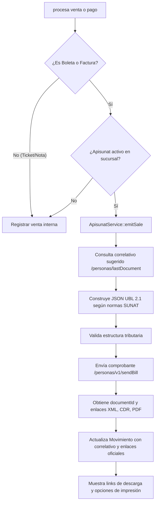

# Análisis Técnico: Módulo de Facturación Electrónica SaaS (Apisunat)

Este documento detalla la arquitectura, la base de datos, las configuraciones por sucursal y la lógica de negocio implementadas en el sistema para habilitar la **Facturación Electrónica SaaS** utilizando **Apisunat** como proveedor tecnológico. 

La integración permite que cada sucursal del sistema multiempresa y multisucursal actúe como un emisor electrónico independiente ante la **SUNAT** (Perú) con sus propias credenciales, series y URLs de API.

---

## 1. Arquitectura General y Flujo de Datos

El sistema implementa una arquitectura SaaS donde las configuraciones de facturación electrónica se desacoplan a nivel de **sucursal**. El flujo de emisión se realiza de forma asíncrona o síncrona en el momento de procesar una venta o un pedido:



---

## 2. Estructura de Base de Datos y Modelos

Para soportar este comportamiento SaaS, se han realizado dos modificaciones estructurales mayores en la base de datos:

### A. Tabla de Configuración de Facturación (`branch_electronic_billing_configs`)
Esta tabla almacena las credenciales de Apisunat para cada sucursal de manera aislada.

*   **Migración:** [2026_04_08_090000_create_branch_electronic_billing_configs_table.php](file:///c:/laragon/www/Restaurante/database/migrations/2026_04_08_090000_create_branch_electronic_billing_configs_table.php)
*   **Campos clave:**
    *   `id`: Identificador autoincremental.
    *   `branch_id`: Relación única uno a uno (`foreignId`) con la sucursal (`branches`), con restricción de eliminación en cascada.
    *   `provider`: Proveedor de facturación electrónica (por defecto `apisunat`).
    *   `enabled`: Booleano para activar/desactivar la emisión electrónica en la sucursal.
    *   `api_url`: URL de la API del proveedor (por defecto `https://back.apisunat.com`).
    *   `persona_id`: Identificador de la empresa asignado por Apisunat.
    *   `persona_token`: Token de autorización (JWT o API Key) para el entorno correspondiente.
    *   `series_boleta`: Serie asignada a las boletas (longitud 4, ej. `B001`).
    *   `series_factura`: Serie asignada a las facturas (longitud 4, ej. `F001`).

*   **Modelo Eloquent:** `App\Models\BranchElectronicBillingConfig` en [BranchElectronicBillingConfig.php](file:///c:/laragon/www/Restaurante/app/Models/BranchElectronicBillingConfig.php)
    ```php
    class BranchElectronicBillingConfig extends Model {
        protected $fillable = [
            'branch_id', 'provider', 'enabled', 'api_url', 
            'persona_id', 'persona_token', 'series_boleta', 'series_factura'
        ];
        protected $casts = ['enabled' => 'boolean'];
        
        public function branch() {
            return $this->belongsTo(Branch::class);
        }
    }
    ```

### B. Campos de Factura Electrónica en Ventas (`movements`)
La tabla de movimientos almacena toda la información del resultado del proceso de firma y envío de comprobantes electrónicos oficiales.

*   **Migración:** [2026_04_08_090100_add_electronic_invoice_columns_to_movements_table.php](file:///c:/laragon/www/Restaurante/database/migrations/2026_04_08_090100_add_electronic_invoice_columns_to_movements_table.php)
*   **Campos agregados:**
    *   `electronic_invoice_provider` (string, max 50): Proveedor del comprobante (ej. `apisunat`).
    *   `electronic_invoice_status` (string, max 30): Estado del comprobante.
    *   `electronic_invoice_external_id` (string): UUID retornado por Apisunat para identificar el comprobante.
    *   `electronic_invoice_series` (string, max 8): Serie utilizada (ej. `F001`).
    *   `electronic_invoice_number` (string, max 30): Correlativo oficial (ej. `00000045`).
    *   `electronic_invoice_file_name` (string): Nombre del archivo PDF asignado.
    *   `electronic_invoice_pdf_ticket_url` (text): Enlace directo al formato ticket (80mm) provisto por Apisunat.
    *   `electronic_invoice_pdf_a4_url` (text): Enlace directo al formato PDF A4 provisto por Apisunat.
    *   `electronic_invoice_xml_url` (text): Enlace de descarga del archivo XML firmado.
    *   `electronic_invoice_cdr_url` (text): Enlace de descarga de la Constancia de Recepción (CDR) de SUNAT.
    *   `electronic_invoice_response` (json): Respuesta completa en crudo recibida desde la API.

---

## 3. Interfaz de Configuración por Sucursal (SaaS Multi-inquilino)

La configuración se integra directamente en la pantalla de **Edición de Sucursal** (`admin/herramientas/empresas/{company}/sucursales/{branch}/edit`).

### A. Vista Formulario (`resources/views/branches/_form.blade.php`)
Se agregó una sección visual premium en [_form.blade.php](file:///c:/laragon/www/Restaurante/resources/views/branches/_form.blade.php) titulada **Facturación electrónica SaaS** que gestiona de manera dinámica la configuración:

1.  **Toggle principal (`electronic_billing_enabled`):** Un checkbox interactivo que habilita o deshabilita la facturación.
2.  **API URL (`electronic_billing_api_url`):** Campo de tipo URL pre-cargado con la ruta por defecto de Apisunat.
3.  **Persona ID (`electronic_billing_persona_id`):** ID del cliente en Apisunat.
4.  **Token producción (`electronic_billing_persona_token`):** Entrada de texto para el token secreto.
5.  **Serie Boleta (`electronic_billing_series_boleta`):** Entrada alfanumérica forzada a mayúsculas automáticamente en la lógica.
6.  **Serie Factura (`electronic_billing_series_factura`):** Entrada alfanumérica forzada a mayúsculas.

### B. Lógica del Controlador (`app/Http/Controllers/BranchController.php`)
Cuando el formulario de sucursal es enviado (`store` o `update`), se ejecuta la sincronización de la configuración en [BranchController.php](file:///c:/laragon/www/Restaurante/app/Http/Controllers/BranchController.php):

*   **Validación de campos:**
    ```php
    'electronic_billing_enabled' => ['nullable', 'boolean'],
    'electronic_billing_api_url' => ['nullable', 'url', 'max:255'],
    'electronic_billing_persona_id' => ['nullable', 'string', 'max:255'],
    'electronic_billing_persona_token' => ['nullable', 'string', 'max:255'],
    'electronic_billing_series_boleta' => ['nullable', 'string', 'max:8'],
    'electronic_billing_series_factura' => ['nullable', 'string', 'max:8'],
    ```
*   **Sincronización:** El método privado `syncElectronicBillingConfig(Branch $branch, Request $request)` administra la inserción o actualización mediante el método Eloquent `firstOrNew`:
    ```php
    private function syncElectronicBillingConfig(Branch $branch, Request $request): void
    {
        $config = BranchElectronicBillingConfig::query()->firstOrNew([
            'branch_id' => $branch->id,
        ]);
        $config->fill([
            'provider' => 'apisunat',
            'enabled' => $request->boolean('electronic_billing_enabled'),
            'api_url' => $request->input('electronic_billing_api_url') ?: config('apisunat.url'),
            'persona_id' => $request->input('electronic_billing_persona_id'),
            'persona_token' => $request->input('electronic_billing_persona_token'),
            'series_boleta' => strtoupper(trim((string) ($request->input('electronic_billing_series_boleta') ?: 'B001'))),
            'series_factura' => strtoupper(trim((string) ($request->input('electronic_billing_series_factura') ?: 'F001'))),
        ]);
        $config->save();
    }
    ```

---

## 4. Servicio Core de Integración (`ApisunatService.php`)

El núcleo operativo se encuentra encapsulado en [ApisunatService.php](file:///c:/laragon/www/Restaurante/app/Services/ApisunatService.php). Este servicio desacoplado expone métodos claves para gestionar todo el ciclo de vida del comprobante electrónico:

### A. Elegibilidad del Documento (`isEligibleDocument`)
Valida si el documento cargado en la venta corresponde a un tipo con validez fiscal electrónica (Boleta de Venta o Factura).

### B. Verificación de Configuración (`isConfiguredForBranch`)
Verifica si la sucursal actual tiene facturación electrónica configurada y activa, y si los tokens de autenticación no están vacíos.

### C. Emisión del Comprobante (`emitSale`)
El método principal realiza los siguientes pasos lógicos:
1.  **Carga de Relaciones:** Obtiene los detalles de la venta, tasas de impuesto correspondientes (`taxRate`), e información del cliente y la sucursal.
2.  **Consulta de Correlativos:** Envía una solicitud `POST` a `/personas/lastDocument` de la API de Apisunat para obtener el último correlativo registrado para la serie y tipo solicitados, retornando un número sugerido (`suggestedNumber`) para mitigar colisiones.
3.  **Construcción de Cabeceras UBL:** Genera la estructura UBL 2.1 con formato JSON compatible con Apisunat:
    *   Datos del emisor (RUC y razón social de la sucursal).
    *   Datos del cliente (DNI, RUC o clientes varios).
    *   Condiciones de pago (Contado/Crédito).
4.  **Procesamiento de Líneas:** Itera los detalles del movimiento descartando cancelados y procesa:
    *   Cantidades facturables (restando cortesías de la venta si existen).
    *   Cálculo hacia atrás del IGV (desglosando el subtotal y el IGV del total basándose en el porcentaje de IGV configurado en la sucursal o el producto).
    *   Manejo de descripciones compuestas incluyendo los complementos seleccionados del plato/producto.
5.  **Pre-validación Estricta (`validateDocumentBodyForSunat`):** Comprueba que no existan items con importe cero, que las tasas de impuestos correspondan a códigos válidos (ej. razón de exoneración `10` e ID `1000` para el IGV), y que la información fiscal del emisor no tenga campos vacíos. Esto reduce el rechazo inmediato de SUNAT.
6.  **Transmisión a la API:** Envía la información al endpoint `/personas/v1/sendBill` utilizando un cliente HTTP (`Http::timeout(35)`).
7.  **Persistencia de Enlaces Oficiales:** Obtiene el `documentId` único de Apisunat y consulta el endpoint `/documents/{id}/getById` para extraer dinámicamente los enlaces oficiales de descarga del **XML firmado** y la **Constancia de Recepción (CDR)** usando expresiones de búsqueda recursivas (`findUrlByKeyword`).

### D. Consulta Rápida de Identidades (`consultDocument`)
Permite validar en tiempo real los datos de un DNI o RUC desde la interfaz del sistema conectándose con los endpoints correspondientes de Apisunat:
*   `/personas/{id}/getDNI?dni={dni}`
*   `/personas/{id}/getRUC?ruc={ruc}`

---

## 5. Puntos de Integración en el Punto de Venta (POS) y Caja

La facturación SaaS se conecta directamente a los módulos operacionales del sistema:

### A. Venta Directa en Mostrador (`SalesController`)
Cuando se registra una venta mediante el POS (`SalesController::processSale`):
*   Se verifica el tipo de documento del movimiento.
*   Se ejecuta de manera síncrona el método privado `syncElectronicInvoiceForSale` en [SalesController.php](file:///c:/laragon/www/Restaurante/app/Http/Controllers/SalesController.php):
    ```php
    private function syncElectronicInvoiceForSale(Movement $movement, ApisunatService $apisunatService): array
    {
        if (!$apisunatService->isEligibleDocument($movement)) {
            return ['status' => 'SKIPPED'];
        }
        if (!$apisunatService->isConfiguredForBranch($movement->branch)) {
            return ['status' => 'NOT_CONFIGURED', 'message' => 'La sucursal no tiene Apisunat configurado.'];
        }
        try {
            $result = $apisunatService->emitSale($movement);
            if ($result['status'] === 'SENT') {
                $data = $result['data'];
                $movement->update([
                    'electronic_invoice_provider' => $data['provider'] ?? 'apisunat',
                    'electronic_invoice_status' => 'SENT',
                    'electronic_invoice_external_id' => $data['external_id'] ?? null,
                    'electronic_invoice_series' => $data['series'] ?? null,
                    'electronic_invoice_number' => $data['correlative'] ?? null,
                    'electronic_invoice_file_name' => $data['file_name'] ?? null,
                    'electronic_invoice_pdf_ticket_url' => $data['pdf_ticket_80mm'] ?? null,
                    'electronic_invoice_pdf_a4_url' => $data['pdf_a4'] ?? null,
                    'electronic_invoice_xml_url' => $data['xml_url'] ?? null,
                    'electronic_invoice_cdr_url' => $data['cdr_url'] ?? null,
                    'electronic_invoice_response' => $data['response'] ?? null,
                ]);
            }
            return $result;
        } catch (\Exception $e) {
            $movement->update([
                'electronic_invoice_provider' => 'apisunat',
                'electronic_invoice_status' => 'ERROR',
                'electronic_invoice_response' => ['error' => $e->getMessage()],
            ]);
            return ['status' => 'ERROR', 'message' => $e->getMessage()];
        }
    }
    ```

### B. Pago de Pedidos en Salón (`OrderController`)
En el flujo de restaurante donde se atienden mesas y se cobra al final (`OrderController::processOrderPayment`):
*   Se genera el movimiento de salida a partir de la orden.
*   Si el método de pago requiere comprobante (Boleta o Factura), se invoca exactamente el mismo método `syncElectronicInvoiceForSale` en [OrderController.php](file:///c:/laragon/www/Restaurante/app/Http/Controllers/OrderController.php), garantizando coherencia en la emisión de ambos tipos de flujos.

### C. Conversión Manual de Tickets (`SalesController::convertTicketToElectronic`)
Si una venta se registró inicialmente como un "Ticket interno" o "Nota de venta" (sin validez fiscal), el sistema permite al cajero o administrador acceder al módulo de ventas, seleccionar la transacción y hacer clic en **Convertir a Electrónico**:
*   La ruta asociada es `POST /admin/ventas/{sale}/convertir-electronico`.
*   El método actualiza el tipo de documento del movimiento a Boleta o Factura (según lo seleccionado por el cajero), actualiza la información del cliente y dispara el servicio de Apisunat para realizar la declaración tributaria oficial en tiempo real.

### D. Redireccionamiento Dinámico de Archivos
Para evitar almacenar copias de XML, CDR o PDFs A4 pesados en el almacenamiento local de Laravel, el [SalesController.php](file:///c:/laragon/www/Restaurante/app/Http/Controllers/SalesController.php) expone rutas dinámicas de redirección:
*   `GET /admin/ventas/{sale}/electronico/pdf-a4` -> `redirectElectronicPdfA4`
*   `GET /admin/ventas/{sale}/electronico/xml` -> `redirectElectronicXml`
*   `GET /admin/ventas/{sale}/electronico/cdr` -> `redirectElectronicCdr`

Estas rutas llaman a `ApisunatService::getDocumentById` con el `electronic_invoice_external_id` almacenado en base de datos para extraer el enlace de descarga actualizado de forma directa y redirigir al usuario al servidor del proveedor mediante un redireccionamiento HTTP temporal (`302`).

---

## 6. Configuración Predeterminada y Fallbacks

*   **Configuraciones globales (Config Laravel):** Ubicadas en `config/apisunat.php` o cargadas mediante variables del entorno `.env`:
    *   `APISUNAT_URL`: URL API predeterminada (`https://back.apisunat.com`).
    *   `APISUNAT_SERIES_BOLETA`: Serie por defecto si no se ingresa en sucursal (`B001`).
    *   `APISUNAT_SERIES_FACTURA`: Serie por defecto si no se ingresa en sucursal (`F001`).
*   **Tasas de Impuesto Predeterminadas:** Si un producto no tiene tasa de impuesto definida o la sucursal no tiene seleccionada una tasa de IGV predeterminada (`igv_defecto` en los parámetros de sucursal), el servicio toma como valor de respaldo el 18.0% predeterminado para evitar errores de cálculo tributario en SUNAT.
*   **Aislamiento de Errores:** Si la API de Apisunat falla (por problemas de red o credenciales incorrectas), el controlador captura la excepción y guarda el estado `ERROR` junto con el mensaje del fallo en el campo `electronic_invoice_response` del movimiento. Esto permite guardar la transacción financiera localmente, informando al cajero que el comprobante puede ser retransmitido manualmente en el futuro sin perder el control de la caja del día.
